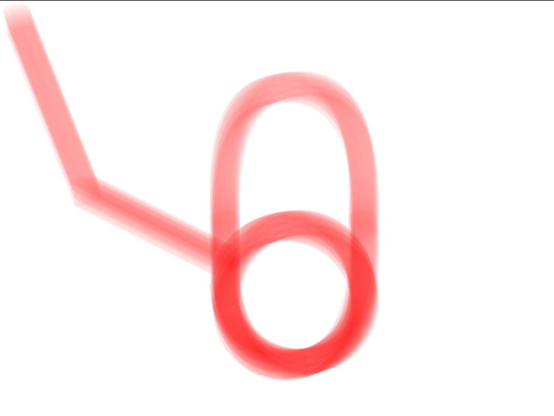

## Nuclear Fusion

Nuclear Fusion (NF) is an experimental library for generative art using Python and C++.


### Building
NF depends on `SFML` for drawing and `pybind11` to create Python bindings. See dependencies 
on how to install it.

To build using `cmake` run
```
mkdir build && cd build
cmake ..
make
```

This will create shared libraries with the python bindings and a 
`./main` example program

### Dependencies
#### Linux
On Linux installing the dependencies is quite easy.

For SFML run
```
sudo apt install libsfml-dev
```

For pybind11 run
```
sudo pip install pybind11
```

### Python Bindings

NF offers Python bindings through pybind11. Python is the best way to
program using NF, as it allows for quick and easy prototyping and has many
libraries such as OpenCV and skimage to aid in generative art. 

The bindings are inside the build folder on the `nuclear_fusion` shared library(`.so`).
Note that the bindings depend on the other shared libraries inside the folder. 

Here is an example program in Python:

```python
import nuclear_fusion as nf

# window will be available until the program quits
window = nf.Window()

# create a brush for drawing
brush = nf.Brush("../brushes/3.png", 50, 50)
# set brush color to red
# it's best to set the color to low opacity
brush.set_color(255, 0, 0, 8)

# draw on the window
brush.draw_line(window, 100, 250, 1, 1)
brush.draw_line(window, 300, 350, 100, 250)
brush.draw_circle(window, 400, 400, 100)
brush.draw_ellipse(window, 400, 300, 100, 200)
```

And the output:

